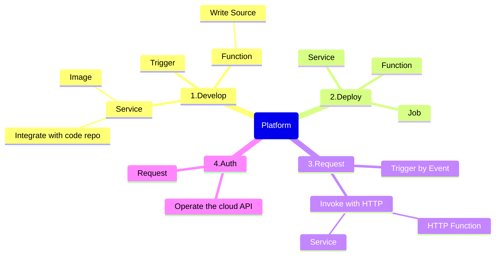

# Core concepts

GCP，Google Cloud Platform
GCE，Google Compute Engine
GKE，Gooke Kubenete Engine
Cloud Run，Google Serverless
IAM，Identity and Access Management

# Core function



# Question
## Service or Function?

GCP Demo Java Function

```java
package gcfv2;

import java.io.BufferedWriter;

import com.google.cloud.functions.HttpFunction;
import com.google.cloud.functions.HttpRequest;
import com.google.cloud.functions.HttpResponse;

public class HelloHttpFunction implements HttpFunction {
  public void service(final HttpRequest request, final HttpResponse response) throws Exception {
    final BufferedWriter writer = response.getWriter();
    writer.write("Hello world!");
  }
}

```

## OpenFaas

K8s GKE

## URL
* Use the api gateway to mapping url. Do auth then invoke the GCP service endpoint. 
Which type of gateway is currently in use?

## Auth
Current auth solution.
Public

## Others

Dev enviroment doc. Maven/Gradle config, Docker Hub？Other middleware config.

Java -> GCP -> Run.    GCP : Docker Hub
Dev 数据库 ： GCP 自己搭数据库 MySQL


# Reference
* [Cloud Run \| Google Cloud](https://cloud.google.com/run?hl=en)
* [What is Cloud Run  \|  Cloud Run Documentation  \|  Google Cloud](https://cloud.google.com/run/docs/overview/what-is-cloud-run)