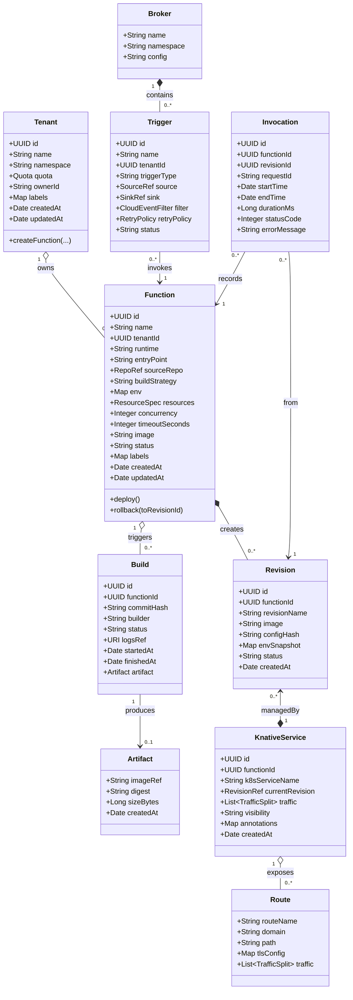

可以——**用 DDD 来建模你要用 Spring 封装 Knative 的 Serverless + FaaS 平台是非常合适的**。Knative 本身把运行时（Serving）和事件（Eventing）做了清晰的 CRD 抽象（Service/Configuration/Revision/Route、Broker/Trigger/Channel/Subscription 等），这些正好能映射到 DDD 的聚合、实体与领域事件。你既能用 DDD 明确边界（bounded contexts）、一致性边界（aggregate roots）、也能把 Knative 的最终一致性/异步流程（build → revision → route）以领域事件与 Saga 管理起来。参考：Knative Serving 与 Eventing 的概念。([knative.dev][1])

下面给出：

1. **建议的边界（Bounded Contexts）与聚合设计**（高内聚、低耦合）
2. **逐个领域对象（实体 / 值对象 / 聚合根）及详细属性**
3. **Mermaid 的领域对象 UML（classDiagram），包含属性与依赖关系**（可直接拷入 Mermaid 渲染器）
4. **实现建议（Spring 包结构、适配器、异步/一致性策略）**
5. **参考实现 / 生态对照（Spring Cloud Function、Knative Functions、OpenShift/Cloud Run 等）**，并给出关键出处，方便落地。([GitHub][2], [knative.dev][3], [Red Hat Documentation][4])

---

# 1) 建议的边界（Bounded Contexts）

（每个上下文都可以做成一个 Spring Boot 模块或 Maven 子模块）

* **Platform Management（平台管理）**：租户、配额、命名空间、多租户策略、RBAC、域名管理。
* **Function Authoring（函数编写/版本）**：函数元数据、源码仓库、构建策略（buildStrategy）、代码签名。
* **Build & Artifact（构建与镜像）**：源码 -> build pipeline（pack/kaniko/tekton/s2i）-> artifact(image)。
* **Runtime / Serving（运行时/暴露）**：Knative Serving 映射（Service/Configuration/Revision/Route），流量分配、滚动/回滚策略。([knative.dev][1])
* **Eventing & Triggers（事件/触发）**：Broker/Trigger/Source/Channel/Subscription 的抽象与映射（事件过滤、重试、DLQ）。([knative.dev][5])
* **Observability & Billing（观测 + 计费）**：度量采集、日志、调用计费/计量。
* **Security & Registry（安全/镜像仓库）**：Secret 管理、ServiceAccounts、镜像仓库适配。

---

# 2) 关键聚合/实体与建议属性（尽可能详细）

> 下面把“领域对象名：类型（聚合根/实体/值对象） — 主要属性（含类型 & 语义说明）”列出。

### Tenant（聚合根 — Platform Management）

* id: UUID
* name: String
* namespace: String （Kubernetes 命名空间）
* ownerId: UUID / UserRef
* quota: Quota（值对象） { cpu, memory, maxFunctions, concurrentInvocations }
* acl/policies: List\<Policy>
* createdAt / updatedAt

### Function（聚合根 — Function Authoring / FaaS）

* id: UUID
* name: String
* tenantId: UUID
* runtime: Enum {java, nodejs, python, go,...}
* entryPoint: String（类名/函数名 / handler）
* sourceRepo: RepoRef { url, branch, path }
* buildStrategy: Enum {pack, kaniko, s2i, tekton}
* env: Map\<String,String>
* resources: ResourceSpec { cpu, memory, ephemeralStorage }
* concurrency: Integer（每实例并发 / targetConcurrency）
* timeoutSeconds: Integer
* image: String（最新已发布镜像）
* status: Enum {Draft, Building, Ready, Deployed, Failed}
* labels / annotations: Map
* createdAt / updatedAt
* domain methods: publish(), deploy(), rollback(toRevision), scalePolicy()

### Build（实体 / 聚合内实体 — Build & Artifact）

* id: UUID
* functionId: UUID
* commitHash: String
* builder: String (pack/kaniko/tekton/s2i)
* status: Enum {Queued, Running, Succeeded, Failed}
* logsRef: URI
* startedAt / finishedAt
* artifact: Artifact（值对象）

### Artifact（值对象）

* imageRef: String（registry/repo\:tag 或 digest）
* digest: String
* sizeBytes: Long
* createdAt

### Revision（实体 — Knative Revision 映射）

* id: UUID
* functionId: UUID
* revisionName: String（knative revision 名）
* image: String
* configHash: String（配置快照哈希）
* envSnapshot: Map
* status: Enum {Pending, Active, Failed, Unknown}
* createdAt

（**说明**：Knative 中每次配置变更会生成 Revision，建议将 Revision 作为不可变实体保存以便回滚与审计。）([knative.dev][6])

### KnativeService（聚合/投影 — 表示集群中对应的 KService）

* id: UUID
* functionId: UUID
* k8sServiceName: String
* currentRevision: RevisionRef
* traffic: List\<TrafficSplit> {revisionName, percent}
* visibility: Enum {External, ClusterLocal}
* annotations: Map
* createdAt

（映射到 Knative CRD `Service` / `Configuration` / `Route`。）([knative.dev][7])

### Route / Configuration（实体 / 值对象）

* routeName, domain, path, tlsConfig, trafficSplits

### Trigger（聚合根 — Eventing）

* id, name, tenantId
* type: Enum {BrokerTrigger, ChannelSubscription, SourceToSink}
* source: SourceRef {type, config}
* sink: SinkRef {functionId or knativeServiceRef}
* filter: CloudEventFilter {attributes}
* retryPolicy: RetryPolicy
* status, createdAt, updatedAt

（Knative Eventing 的 Broker/Trigger/Channel/Subscription 模型对应这里的 Trigger / Broker / Subscription。可以把 Trigger 作为对 Knative Trigger 的领域封装。）([knative.dev][5])

### Invocation / ExecutionRecord（实体 — 观测）

* id, functionId, revisionId, requestId, startTime, endTime, durationMs, statusCode, errorMessage, memPeak

### AutoscalePolicy（值对象）

* minScale, maxScale, targetConcurrency, cpuThreshold, customMetrics

### Registry / SecretRef（基础设施对象）

* registryUrl, credentialsRef, secretName

### Policy / IAM（实体）

* roleBindings, serviceAccounts, allowedActions

### Domain Events（示例）

* FunctionPublishedEvent(functionId, revisionId)
* BuildSucceededEvent(buildId, artifact.imageRef)
* RevisionReadyEvent(revisionId)
* InvocationFailedEvent(invocationId, reason)

---

# 3) Mermaid 领域对象 UML（可直接复制到支持 Mermaid 的编辑器）

下面的 Mermaid 图以 classDiagram 风格呈现主要实体、聚合与关系（尽量详细列出属性）。你可以直接把下面代码粘贴到 Mermaid 渲染器中查看：



> 注：Mermaid 的 classDiagram 在不同渲染器上对 multiplicity 的支持程度不同；上面重点表达聚合和组合（`o--` / `*--`）与依赖箭头（`-->`），便于设计思路理解。

---

# 4) 如何把 DDD 聚合映射到 Knative / Spring 技术栈（实施建议）

### 领域层（domain）

* 把上面列的实体/值对象实现为 POJO（不可变的值对象，实体有唯一 id）。
* 把业务逻辑放在聚合根的方法里（例如 `Function.publish()`、`Function.deploy()` 触发 domain events）。
* 把领域事件序列化到事件总线（Kafka / EventStore / DB）以支持异步 Saga。

### 应用层（application）

* **Application Services**（如 `FunctionDeploymentService`、`BuildOrchestrator`）：负责事务脚本式的编排（接收命令、调用聚合、发布领域事件）。
* **Process Manager / Saga**：负责跨聚合流程（如 build 完成后创建 Revision -> 更新 Knative Service 的流量），用事件驱动来保证最终一致性。

### 基础设施层（infrastructure / adapters）

* **Kubernetes / Knative Adapter**：使用 Fabric8 或官方 Kubernetes Java 客户端，把聚合操作映射为 CRD 操作（create Knative Service / create Trigger / create Broker 等）。

  * 例如：`KnativeServiceRepository.create(knativeServiceSpec)` 会构造 `serving.knative.dev/v1 Service` 的 YAML/CR 对象并 `apply`。（Knative Serving 的核心资源：Service、Configuration、Revision、Route）。([knative.dev][1])
* **Build Adapter**：触发 Tekton / Cloud Build / custom builders，并把 Build 事件回写为领域事件（BuildSucceeded / BuildFailed）。
* **Registry Adapter**：处理镜像推送与凭证（Secret）管理。
* **Eventing Adapter**：封装 Knative Eventing 的 Broker/Trigger/Channel/Subscription 的创建/管理。([knative.dev][5])

### Spring 具体包结构建议（示例）

```
com.myorg.serverless
 ├─ domain
 │   ├─ tenant
 │   ├─ function
 │   └─ build
 ├─ application
 │   ├─ service
 │   └─ saga
 ├─ infra
 │   ├─ k8s (Knative adapter)
 │   ├─ build (tekton adapter)
 │   └─ registry
 ├─ web (REST/gRPC controllers)
 └─ events (integration with kafka / spring-cloud-stream)
```

### 关于函数运行时：Spring Cloud Function 与 Knative Functions

* **Spring Cloud Function** 是把业务逻辑以 `Function`/`Supplier`/`Consumer` 的形式写好，然后能在不同宿主（Lambda / Fn / Knative）上运行的通用模型。它非常适合 Java/Spring 的 Function 编写。([GitHub][2])
* **Knative Functions (`func` CLI)** 是对用户暴露的 Function 开发/部署体验，可把函数构建为 Knative Service。若你想给平台用户提供“函数模板 + 一键构建 + 一键部署”的体验，可以参考 Knative Functions。([knative.dev][3])

---

# 5) 一些关键设计建议（实践中常犯的坑 & How-to）

* **把 Revision 作为不可变实体并保存**，这样 rollback 与审计很容易。Knative 本身每次 config 更新都会产出 Revision。([knative.dev][6])
* **不要把 Knative CRD 直接当作主数据**：你的领域模型（Function, Revision, Build）最好先在 DB（Postgres/Etcd）里有一份权威状态，再通过适配器去 reconcile 到 k8s。CRD 作为投影 / 最终执行态。
* **采用事件驱动 + Saga 协调构建/部署流程**（BuildSucceeded -> Create Revision -> Wait RevisionReady -> Update Service Traffic）。这避免同步阻塞。
* **用 annotations/labels 映射聚合 id**（在创建 Knative Service/Revision 时打上 `myorg.com/function-id: <UUID>` 标签），方便从 k8s 事件回溯到领域对象。
* **指标与计费**：把 Invocation/Duration/MemPeak 等做为事件入流，用流处理（Kafka/Prometheus -> aggregator）做计费/报警。
* **安全/多租户**：每租户独立 namespace + RBAC + resource quota（Knative/OpenShift 都支持），OpenShift Serverless 给企业用户的实现有很多参考。([Red Hat Documentation][4])

---

# 6) 参考链接（我在建模时参考的官方/实例资料）

* Knative Serving（Service / Configuration / Revision / Route）—— 官方文档（Serving 概念与 CRD 说明）。([knative.dev][1])
* Knative Eventing（Broker / Trigger / Channels / Subscriptions）—— 官方文档。([knative.dev][5])
* Knative Functions（`func` CLI 与函数体验）—— 官方 Functions 说明。([knative.dev][3])
* Spring Cloud Function（官方 GitHub / 项目）—— 用于把 Spring 函数作为 FaaS 单位。([GitHub][2])
* OpenShift Serverless（基于 Knative 的企业实现 / Functions 支持）—— 参考企业级实现方式（多租户、构建策略、S2I、Buildpacks）。([Red Hat Documentation][4])

---

# 结论（可执行的第一步）

1. **建立三个初始模块**：`domain`（实现 Function/Revision/Build 聚合），`infra/k8s-adapter`（封装 Knative CRD create/apply），`application`（FunctionDeploymentService + 简单 Saga）。
2. **在领域上先做最小可行模型**：Function + Build + Revision + KnativeService 映射，先实现从源码到镜像（can be stub）→ 创建 Revision → 等待 Revision Ready → 更新 Knative Service Traffic 的完整流程。
3. **使用 Spring Cloud Function 作为运行时样板**（如果你的用户主要写 Java/Spring），并把 handler 的打包镜像自动注入到 Revision。([GitHub][2], [knative.dev][3])

---

如果你愿意，我可以马上把上面的 **Mermaid 图做成更大的“全域模型”版本**（包括更多对象如 Billing、Quota、Policy），并生成 **按包划分的 UML**（方便你直接 scaffold 出 Spring module/package）。或者我可以把上面的每个聚合展开成 JSON Schema（便于建数据库表）——你想先要哪一种？ 😊

[1]: https://knative.dev/docs/serving/?utm_source=chatgpt.com "Knative Serving"
[2]: https://github.com/spring-cloud/spring-cloud-function?utm_source=chatgpt.com "spring-cloud/spring-cloud-function"
[3]: https://knative.dev/docs/functions/?utm_source=chatgpt.com "Knative Functions overview"
[4]: https://docs.redhat.com/en/documentation/red_hat_openshift_serverless/1.35/html/about_openshift_serverless/about-serverless?utm_source=chatgpt.com "Chapter 2. OpenShift Serverless overview - Red Hat Documentation"
[5]: https://knative.dev/docs/eventing/?utm_source=chatgpt.com "Knative Eventing overview"
[6]: https://knative.dev/docs/serving/revisions/?utm_source=chatgpt.com "About Revisions - Knative"
[7]: https://knative.dev/docs/serving/services/?utm_source=chatgpt.com "About Knative Services"


# Reference