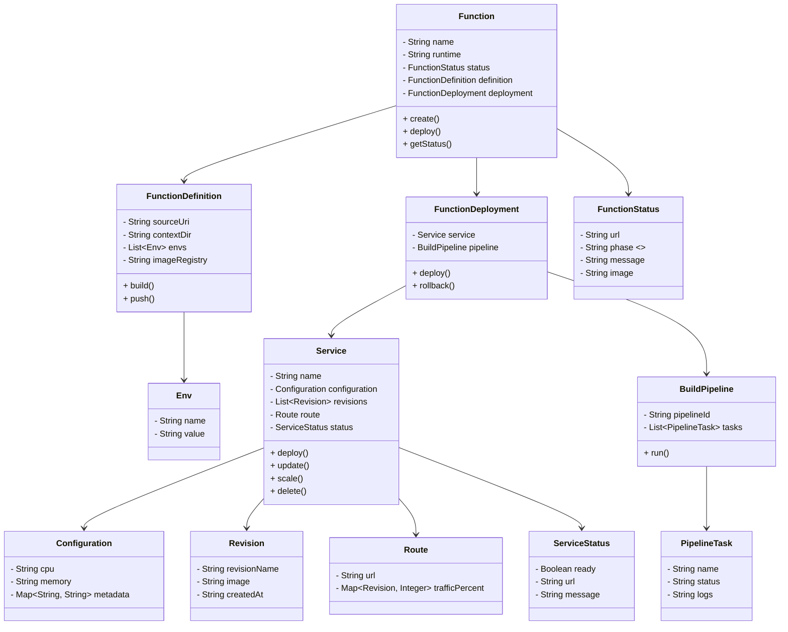

## Domain Model AI

```mermaid
classDiagram
%% ========== Function 聚合 ==========
class Function {
  - String name
  - String runtime
  - FunctionStatus status
  - FunctionDefinition definition
  - FunctionDeployment deployment
  + create()
  + deploy()
  + getStatus()
}

class FunctionDefinition {
  - String sourceUri
  - String contextDir
  - List~Env~ envs
  - String imageRegistry
  + build()
  + push()
}

class FunctionDeployment {
  - Service service
  - BuildPipeline pipeline
  + deploy()
  + rollback()
}

%% ========== Service 聚合 ==========
class Service {
  - String name
  - Configuration configuration
  - List~Revision~ revisions
  - Route route
  - ServiceStatus status
  + deploy()
  + update()
  + scale()
  + delete()
}

%% ========== 值对象 ==========
class Env {
  - String name
  - String value
}

class FunctionStatus {
  - String url
  - String phase <<enum>>
  - String message
  - String image
}

class Configuration {
  - String cpu
  - String memory
  - Map~String, String~ metadata
}

class Revision {
  - String revisionName
  - String image
  - String createdAt
}

class Route {
  - String url
  - Map~Revision, Integer~ trafficPercent
}

class ServiceStatus {
  - Boolean ready
  - String url
  - String message
}

class BuildPipeline {
  - String pipelineId
  - List~PipelineTask~ tasks
  + run()
}

class PipelineTask {
  - String name
  - String status
  - String logs
}

%% ========== 依赖关系 ==========
Function --> FunctionDefinition
Function --> FunctionDeployment
Function --> FunctionStatus

FunctionDefinition --> Env

FunctionDeployment --> Service
FunctionDeployment --> BuildPipeline

Service --> Configuration
Service --> Revision
Service --> Route
Service --> ServiceStatus

BuildPipeline --> PipelineTask

```

# Reference