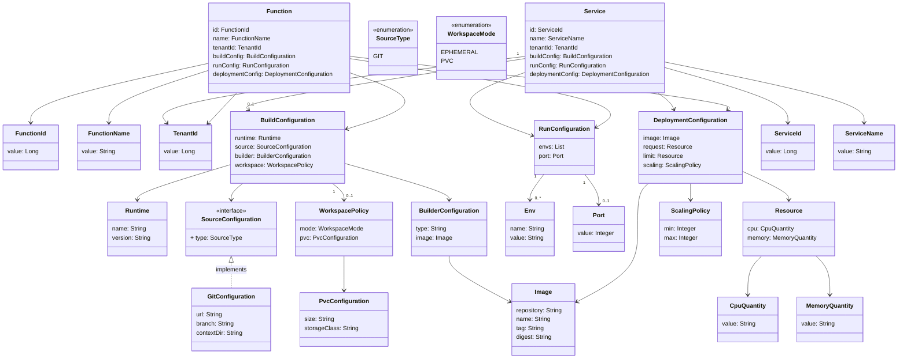

## Domain Model Diagram

```mermaid
classDiagram
    class Function {
        id: FunctionId
        name: FunctionName
        tenantId: TenantId
        buildConfig: BuildConfiguration
        runConfig: RunConfiguration
        deploymentConfig: DeploymentConfiguration
    }
    
    class FunctionId {
        value: Long
    }
    
    class FunctionName {
        value: String
    }
    
    class TenantId {
        value: Long
    }
    

    class BuildConfiguration {
        runtime: Runtime
        source: SourceConfiguration
        builder: BuilderConfiguration
        workspace: WorkspacePolicy
    }
    BuildConfiguration --> Runtime
    BuildConfiguration --> SourceConfiguration
    BuildConfiguration --> BuilderConfiguration
    BuildConfiguration "1" --> "0..1" WorkspacePolicy
    
    class SourceConfiguration {
        <<interface>>
        + type: SourceType
    }
    
    class SourceType {
        <<enumeration>>
        GIT
    }

    class GitConfiguration {
        url: String
        branch: String
        %% The directory in the repository where the function code is located
        contextDir: String
    }
    
    SourceConfiguration <|.. GitConfiguration : implements
    
    class Runtime {
        name: String
        version: String
    }
    
    class BuilderConfiguration {
        %% e.g., "pack"
        type: String
        %% The builder image to use.
        image: Image
    }

    class WorkspacePolicy {
        mode: WorkspaceMode
        pvc: PvcConfiguration
    }
    WorkspacePolicy --> PvcConfiguration
    
    class WorkspaceMode {
        <<enumeration>>
        %% TODO: Only support the PVC mode for now.
        EPHEMERAL
        PVC
    }

    class PvcConfiguration {
        size: String
        storageClass: String
    }
    
    class RunConfiguration {
        envs: List<Env>
        port: Port
    }
    RunConfiguration "1" --> "0..*" Env
    RunConfiguration "1" --> "0..1" Port
    
    class Port {
        value: Integer
    }
    
    class Env {
        name: String
        value: String
    }
    
    class DeploymentConfiguration {
        image: Image
        request: Resource
        limit: Resource
        scaling: ScalingPolicy
    }
    DeploymentConfiguration --> Image
    DeploymentConfiguration --> Resource
    DeploymentConfiguration --> ScalingPolicy


    class Resource {
        cpu: CpuQuantity
        memory: MemoryQuantity
    }
    Resource --> CpuQuantity
    Resource --> MemoryQuantity
    
    class CpuQuantity {
        value: String
    }
    
    class MemoryQuantity {
        value: String
    }
    
    class ScalingPolicy {
        min: Integer
        max: Integer
    }
    
    class Image {
        repository: String
        name: String
        tag: String
        digest: String
    }
    
    %% Function dependencies
    Function --> FunctionId
    
    Function --> FunctionName
    
    Function --> TenantId
    
    %% Function configuration dependencies
    Function --> BuildConfiguration
    Function --> RunConfiguration
    Function --> DeploymentConfiguration

    BuilderConfiguration --> Image

    
    class Service {
        id: ServiceId
        name: ServiceName
        tenantId: TenantId
        buildConfig: BuildConfiguration
        runConfig: RunConfiguration
        deploymentConfig: DeploymentConfiguration
    }
    
    class ServiceId {
        value: Long
    }
    
    class ServiceName {
        value: String
    }
    
    %% Service dependencies
    Service --> ServiceId
    Service --> ServiceName
    Service --> TenantId
    Service "1" --> "0..1" BuildConfiguration
    Service --> RunConfiguration
    Service --> DeploymentConfiguration
```

# Reference