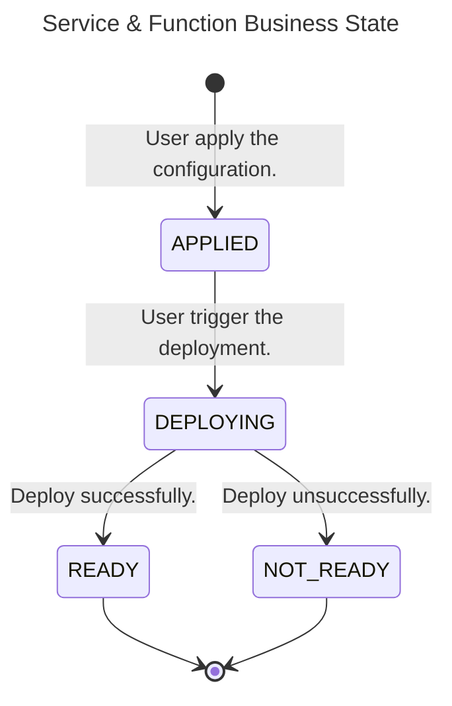

## State Machine

```mermaid
---
title: Service & Function Business State
---
stateDiagram-v2
    [*] --> APPLIED: User apply the configuration.
    APPLIED --> DEPLOYING: User trigger the deployment.
    DEPLOYING --> READY: Deploy successfully.
    DEPLOYING --> NOT_READY: Deploy unsuccessfully.
    READY --> [*]
    NOT_READY --> [*]

```

# Reference