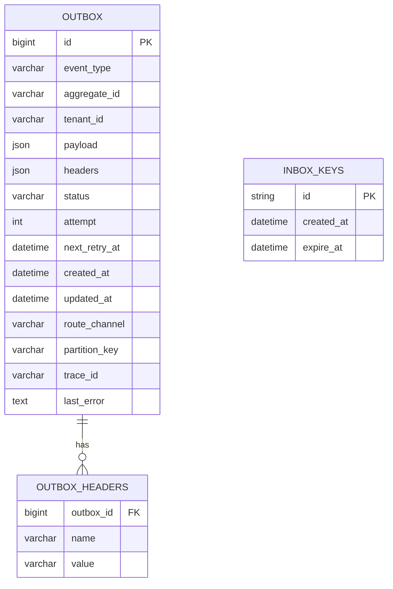
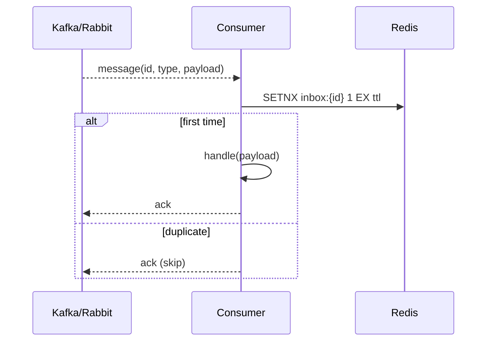

下面给出一份可落地的技术方案（按你要求的“本地消息表 + 可重试 + 解耦 + Redis 幂等 + 易集成”的目标来设计）。在开始之前，先给出少量澄清点；若暂不回复也不影响你直接按本文的“假设”推进 PoC。

**澄清问题（≤5）**

1. 首选消息通道：Kafka / RabbitMQ / Redis Streams / 还是仅 HTTP Webhook？
2. 事务性数据库：MySQL / PostgreSQL？是否开启 binlog/CDC（如 Debezium）能力？
3. 预计峰值吞吐与消息体大小（B/KB 级）？可接受发布端/消费端延迟目标（P99）？
4. Redis 形态：Cluster / Sentinel，高可用与持久化（AOF/RDB）策略？
5. 部署：Kubernetes/Knative 为主吗？是否希望 Relay 可按消息堆积自动弹性伸缩？

— 若暂缺答案，本文以 **MySQL + Kafka + Redis Cluster + K8s/Knative** 为默认假设推进。

---

# 1. Executive Summary

**问题与目标**

* 业务写库要与“对外投递消息/任务”最终一致（不丢、不重、不乱序强调尽力）。
* 内置重试与退避、可配置次数/策略；与业务解耦（低侵入）。
* 基于 Redis 提供生产与消费两侧的幂等控制；易于 Spring Boot 集成。

**关键决策**

* 采用 **Transactional Outbox（本地消息表）模式**：业务写库与 Outbox 写入同一事务提交，避免分布式事务。
* 出箱（Relay）采用**双模式**：a) 轮询表扫描；b) 可选 CDC（Debezium）无轮询低延迟。
* 重试采用**表内状态机 + 指数退避 + 抖动**；死信（DLQ）与人工回放接口。
* 幂等：生产端用 **Idempotency-Key + Redis SETNX**；消费端用 **Inbox-Key + Redis**。
* 提供 **Spring Boot Starter**（自动装配、注解/事件驱动、Starter 配置、Actuator 监控、Admin API）。

**一页图**

```mermaid
flowchart LR
  subgraph App["Business Service (Spring Boot)"]
    Svc[Domain Service\n@OutboxEvent / @TransactionalEventListener]
    OBRepo[OutboxRepository\n(JPA/MyBatis)]
  end

  DB[(MySQL\nbusiness + outbox tables)]
  Relay[Outbox Relay Worker\n(Poller or CDC Consumer)]
  Redis[(Redis Cluster\nIdempotency & Inbox)]
  MQ[[Kafka/RabbitMQ\nor Webhook]]

  Consumer["Consumer Service(s)\nSpring Boot SDK"]
  Admin["Admin & Ops\n(Actuator + Admin API)"]

  Svc-->OBRepo-->DB
  Relay-- read&lock/publish -->MQ
  Relay-- mark status -->DB
  Relay-- idempotency keys -->Redis
  Consumer-- consume -->Redis
  Consumer-- process -->Consumer
  Admin---DB
  Admin---Redis
```

---

# 2. Requirements

**功能（优先级）**

* P0：本地消息表（Outbox）写入与业务数据同事务提交；Relay 出箱；可重试；DLQ；人工回放。
* P0：生产端/消费端幂等。
* P1：多通道投递（Kafka/RabbitMQ/HTTP）；租户/业务类型路由。
* P1：可配置的重试策略（上限、退避、抖动、可忽略错误）。
* P2：CDC 支持（Debezium）；消息加密/脱敏。
* P2：顺序性（按 Aggregate Key 分区/有序）。

**非功能**

* 延迟：Relay 平均 < 500ms（表轮询场景，轮询间隔可配），CDC < 100ms。
* 吞吐：单实例 ≥ 2k msg/s（依消息大小、DB/Redis/MQ 配置而变）。
* 可用性：99.9%；持久化耐久性 ≥“消息至少投递一次”。
* RPO/RTO：RPO≈0（同库事务提交），RTO ≤ 15min。
* 安全：TLS，凭证集中管控，按租户/服务 RBAC。
* 可达性/可观测性：Actuator 指标，追踪 ID 贯通，审计日志。
* 可访问性/本地化：Admin UI/接口返回国际化消息。

---

# 3. Architecture Overview

**高层组件图**

```mermaid
graph TB
  A[Producer App\n(Spring Boot Starter)] -->|JPA TX| DB[(MySQL)]
  A -->|Idempotency-Key| R[(Redis)]
  Relay[Relay Worker\n(Poller/CDC)] --> DB
  Relay --> MQ[[Kafka/RabbitMQ/Webhook]]
  Relay --> R
  C[Consumer App\n(Spring Boot SDK)] --> MQ
  C --> R
  Ops[Ops/Admin] -->|Actuator + Admin API| Relay
```

**部署拓扑**

* K8s/Knative：

  * Producer/Consumer：Deployment/Knative Service（自动伸缩）。
  * Relay：Deployment（或 Knative Service + KEDA 基于待出箱数/滞留时长弹性）。
  * MySQL：托管或 StatefulSet（生产建议托管）。
  * Redis：Cluster。
  * Kafka/RabbitMQ：托管/集群。
* 多 AZ 部署；Relay 与 DB 在同地域/可用区以降低 RTT。

**数据流**

1. 业务写库 + Outbox（同事务）。
2. Relay 扫描待出箱，分发到 MQ/HTTP；更新状态/重试计数。
3. 消费端读 MQ，基于 Redis 幂等执行，完成后 ACK。

---

# 4. Detailed Design by Component

## 4.1 Producer SDK（低侵入）

**使用方式（二选一）**

* 注解模式：`@OutboxEvent(type="OrderCreated", aggregateId="#order.id")` 标注在领域服务方法上。AOP 在事务成功后写入 Outbox。
* 事件模式：`ApplicationEventPublisher` + `@TransactionalEventListener(phase=AFTER_COMMIT)` 将事件持久化为 Outbox 记录。

**接口**

* `OutboxPublisher.publish(event: OutboxEvent)`
* `Idempotency.begin(key, ttl)` / `Idempotency.end(key)`（可自动由拦截器处理）

**失败模式与回退**

* 事务失败：Outbox 不写入。
* 事务成功但 Relay 未及时出箱：由重试/扫描兜底。

## 4.2 Outbox Repository & Table

* 按状态机驱动：`NEW -> PUBLISHING -> PUBLISHED`；失败计数与下次重试时间。
* 行级锁或悲观锁 `FOR UPDATE SKIP LOCKED` 批量领取。
* 分片/分区（按时间或租户）。

## 4.3 Relay Worker

* **Poller**：按 `next_retry_at` 升序批量拉取；并发投递；失败写回状态与下一次重试时间（指数退避+jitter）。
* **CDC**（可选）：订阅 outbox 表变更流，低延迟处理；失败路径与 Poller 一致。
* 通道插件：`KafkaChannel`, `RabbitChannel`, `WebhookChannel`（签名 + HMAC + 重试）。
* 死信：超过 `max_attempts` -> `DLQ`（表+MQ），提供回放。

## 4.4 Idempotency

* **生产端**：`Idempotency-Key`（HTTP Header/业务上下文） -> `Redis.SETNX(key, marker, ttl)`；若已存在，直接返回首次结果（可将结果缓存至 Redis）。
* **消费端**：使用 `messageId` 或 `(topic, partition, offset)` / `(eventType, aggregateId, version)` 组合键 -> `Redis.SETNX(inboxKey)`；命中则丢弃重复。

## 4.5 Consumer SDK

* `@OutboxHandler(type="OrderCreated")` 方法级消费；SDK 自动做幂等检查、反序列化、重试（与 MQ ack 协调），业务仅抛异常表示“可重试”。
* 可配置 **处理超时** 与 **并发度**；支持**顺序键**（同 `aggregateId` 串行）。

## 4.6 Admin & Ops

* Actuator 指标（待出箱、失败率、延迟分布、重试队列长度）。
* Admin API：回放、强制出箱、配置查询与热更新。
* 审计日志：操作人、时间、规则变更。

**替代方案对比**

| 方案              | 优点         | 缺点                        | 适用      |
| --------------- | ---------- | ------------------------- | ------- |
| Outbox + Poller | 实现简单、稳定    | 拉取有额外 DB 压力               | 中等吞吐    |
| Outbox + CDC    | 低延迟、DB 负担小 | 依赖 Debezium/Kafka Connect | 高吞吐、低延迟 |
| 直发 MQ（无 Outbox） | 延迟低        | 需要分布式事务或容忍丢失/重复           | 对一致性要求低 |

---

# 5. Data Model & Storage

**ERD 概要**



**DDL（MySQL 示例，精简版）**

```sql
CREATE TABLE outbox (
  id BIGINT PRIMARY KEY AUTO_INCREMENT,
  event_type VARCHAR(128) NOT NULL,
  aggregate_id VARCHAR(128) NOT NULL,
  tenant_id VARCHAR(64),
  payload JSON NOT NULL,
  headers JSON,
  status ENUM('NEW','PUBLISHING','PUBLISHED','FAILED','DLQ') NOT NULL DEFAULT 'NEW',
  attempt INT NOT NULL DEFAULT 0,
  next_retry_at DATETIME NOT NULL DEFAULT CURRENT_TIMESTAMP,
  route_channel VARCHAR(64) DEFAULT 'kafka',
  partition_key VARCHAR(128),
  trace_id VARCHAR(64),
  last_error TEXT,
  created_at DATETIME NOT NULL DEFAULT CURRENT_TIMESTAMP,
  updated_at DATETIME NOT NULL DEFAULT CURRENT_TIMESTAMP ON UPDATE CURRENT_TIMESTAMP,
  INDEX idx_status_retry (status, next_retry_at),
  INDEX idx_created (created_at),
  INDEX idx_agg (aggregate_id),
  INDEX idx_tenant (tenant_id)
) ENGINE=InnoDB;

CREATE TABLE inbox_keys (
  id VARCHAR(200) PRIMARY KEY,
  created_at DATETIME NOT NULL DEFAULT CURRENT_TIMESTAMP,
  expire_at DATETIME
);
```

**索引/分区/保留**

* 日/周分区（大量写入场景）；DLQ 独立表。
* 归档：已 `PUBLISHED` 且超过保留期（如 7\~30 天）转移到历史表或对象存储。
* 多租户：按 `tenant_id` 做二级索引或分库分表。

**数据治理**

* 架构演进：payload 建议 **JSON Schema** 管控；schema 版本化（`payload.schemaVersion`）。

---

# 6. APIs & Integrations

**Admin OpenAPI（节选）**

```yaml
openapi: 3.0.1
paths:
  /api/outbox/{id}/replay:
    post:
      summary: Replay a DLQ/FAILED message
      parameters: [{ name: id, in: path, required: true, schema: { type: integer } }]
      responses: { "204": { description: "Replayed" } }

  /api/outbox/search:
    get:
      summary: Query outbox messages
      parameters:
        - { name: status, in: query, schema: { type: string } }
        - { name: tenantId, in: query, schema: { type: string } }
      responses: { "200": { description: "OK" } }

  /api/config/retry:
    put:
      summary: Update retry policy
      requestBody:
        content:
          application/json:
            schema:
              type: object
              properties:
                maxAttempts: { type: integer }
                initialBackoffMs: { type: integer }
                multiplier: { type: number }
                jitter: { type: number }
      responses: { "204": { description: "Updated" } }
```

**AuthN/Z**

* 内部 Admin：OIDC (client credentials) + RBAC（仅 Ops 可回放/修改策略）。
* Webhook：HMAC-SHA256 签名头（`X-Signature`）。

**限流/幂等**

* Admin API：令牌桶；回放幂等（请求体 hash 作为 key）。
* 事件版本化 `v1/v2`；兼容性策略：新增字段向后兼容。

**Webhooks/事件重投策略**

* 3 次快速重试（100/300/900ms），之后进入统一重试调度（指数退避）。
* HTTP 失败返回码归类（4xx 可配置为不重试/告警；5xx 重试）。

---

# 7. Workflows & Sequences

**生产（写库+出箱）**

```mermaid
sequenceDiagram
  participant B as BusinessSvc
  participant DB as MySQL
  participant R as Redis
  participant RL as Relay

  B->>DB: BEGIN TX; INSERT business rows
  B->>DB: INSERT INTO outbox (...) VALUES(...)
  B->>DB: COMMIT
  RL-->>DB: SELECT ... WHERE status=NEW AND next_retry_at<=now FOR UPDATE SKIP LOCKED
  RL->>RL: publish via Kafka/Webhook
  RL->>DB: UPDATE outbox SET status=PUBLISHED
```

**消费（幂等处理）**



**Saga/补偿（可选）**

* 以 `aggregateId` 串行；失败后发布补偿事件 `OrderCancelRequested`，由相应服务处理。

---

# 8. Security, Privacy & Compliance

* **STRIDE 概要**

  * 伪造：Webhook 签名校验；JWT 验证。
  * 篡改：事件载荷签名/哈希；数据库最小权限。
  * 抵赖：审计日志（谁在何时回放/修改策略）。
  * 信息泄露：敏感字段脱敏/加密（列级或应用层）。
  * DoS：限流/熔断/回压；Relay 并发受控。
  * 提权：分离 Admin 与运行时角色，K8s RBAC/PodSecurity。
* **加密**：TLS in-transit；at-rest（RDS 加密，Redis TDE/磁盘加密）。
* **Secrets**：K8s Secret + 外部密管（Vault/ASM）。
* **隐私**：最小化字段、可配置脱敏、数据保留策略。

---

# 9. Reliability & Performance

**容量估算（样例）**

* 假设 1k msg/s、平均 1KB：写库 QPS≈1k；索引写约 2\~3k；MySQL 单分片可承受（需合理表设计与批量）。
* Relay：批量领取 200 条 × 20 并发 ≈ 4k msg/s 出箱能力；消费端对等扩容。
* Redis：SETNX/GET QPS 2k\~5k 单节点轻松；Cluster 横向扩展。

**策略**

* 缓存：`next_retry_at` 精确调度降低无效扫描。
* 队列与回压：Relay 并发池满则延后领取。
* 熔断：Webhook/下游故障时降级到慢重试并快速标记失败。
* HA/DR：Relay 多副本 + 领取时 `SKIP LOCKED` 防重；DB 多 AZ；备份演练。
* 混沌：定期注入下游 5xx/超时，验证重试/告警路径。

---

# 10. DevEx, CI/CD & Environments

* **Starter 提供**：`spring.factories`/`AutoConfiguration`；`application.yaml` 一键配置。
* **分支与门禁**：`main` 受保护；合并需单测+合约测通过。
* **IaC**：Terraform/Kustomize；环境：dev/staging/prod；不可变镜像。
* **发布**：蓝绿/金丝雀；数据库变更由 Flyway 管控。

---

# 11. Observability & Operations

* 指标（Prometheus）：

  * Outbox：待出箱计数、出箱速率、失败率、平均/分位延迟、重试队列长度。
  * Relay：投递成功/失败/重试计数、通道维度错误码分布。
  * Idempotency：SETNX 成功率、命中率。
* 日志：结构化（traceId, tenantId, eventType, outboxId）。
* Tracing：OpenTelemetry 贯穿业务→Outbox→Relay→Consumer。
* 告警：

  * 待出箱>阈值（如 100k）或滞留时长 P99>阈值。
  * 连续重试失败率 > x%。
  * DLQ 增长速率异常。

---

# 12. Testing & Quality

* **测试金字塔**：

  * 单测：Outbox 写入、重试计算、幂等工具。
  * 合约测：事件 JSON Schema；Webhook 签名。
  * 集成测：嵌入式 MySQL/Redis/Kafka（Testcontainers）。
  * E2E：真实集群下断网/超时/抖动场景。
  * 性能：JMH/压力脚本（消息大小/并发/延迟曲线）。
* **测试数据**：匿名化、构造边界值（大 payload、重复、乱序）。

---

# 13. Migration & Rollout

1. 引入 Outbox 表与 SDK（灰度一个服务）。
2. Relay 仅监控/只读 dry-run（不投递）验证查询/锁。
3. 开启小流量投递到“影子下游”；比对一致性。
4. 切换真实通道；保留影子监控一段时间。
5. 老路径下线；清理遗留数据。
   **回滚**：关闭 Relay 投递开关；回退版本；数据不丢（仍在 outbox）。

---

# 14. Risks, Assumptions & Trade-offs

**风险记录（示例）**

| 风险                    | 概率×影响 | 负责人    | 缓解               |
| --------------------- | ----- | ------ | ---------------- |
| outbox 表膨胀            | M×H   | DBA    | 分区+归档任务；写入限流     |
| 热键（同 aggregateId 高并发） | M×M   | Dev    | 顺序键分散；分片路由       |
| Webhook 下游不稳定         | H×M   | DevOps | 熔断+退避；切 Kafka    |
| Redis 丢失/抖动           | M×H   | SRE    | AOF; 双活/哨兵；客户端重试 |

**权衡**

* 选择 Outbox 放弃强一致的两阶段提交，换取**简单性与工程可靠性**；接受“至少一次”与**幂等处理成本**。

---

# 15. Costing & Timeline

**成本（粗略）**

* 计算：Relay/Consumer 部署副本数按吞吐线性扩；Knative/KEDA 自适应缩放。
* 存储：MySQL（按 1KB/msg × 7 天保留 ≈ 600MB/百万条）+ 索引开销约 2\~3 倍。
* Redis：小内存足够（幂等 key TTL）；Kafka 集群按峰值带宽配置。

**里程碑（8–12 周样例）**

* W1–2：Starter 雏形（Outbox 实体、写入、基础配置）；DDL/Flyway。
* W3–4：Relay Poller + Kafka/Webhook 通道；指标与Actuator。
* W5–6：Redis 幂等（生产/消费端）；Admin API（回放）。
* W7–8：E2E & 压测；DLQ；分区与归档。
* W9–10：CDC 可选实现；文档/最佳实践；金丝雀发布。
* W11–12：稳定性与混沌演练；推广到第二/三条业务线。

---

# 16. Open Questions & Next Steps

* 选定消息通道（Kafka/RabbitMQ/Webhook 默认策略？是否需要多通道路由规则）。
* 是否启用 Debezium CDC（需要 Kafka Connect 基础设施）。
* 幂等 TTL 的默认策略（按业务窗口 24h/72h？是否缓存首个响应体）。
* 顺序性需求强度 & 分区键选择（按订单/用户/租户）。
* 管控面：是否需要一个简单的 Web Admin（基于 Spring Boot Admin/内部控制台）。

---

## 附：关键代码片段（精简）

**1) 注解与 AOP 拦截（生产端）**

```java
@Target({ElementType.METHOD})
@Retention(RetentionPolicy.RUNTIME)
public @interface OutboxEvent {
  String type();
  String aggregateId() default "";
  String tenantId() default "";
}

@Aspect
@RequiredArgsConstructor
public class OutboxAspect {
  private final OutboxRepository repo;
  private final ObjectMapper om;

  @AfterReturning(pointcut="@annotation(evt)", returning="ret")
  @Transactional
  public void afterCommit(JoinPoint jp, OutboxEvent evt, Object ret) throws Exception {
    var payload = Map.of("result", ret);
    repo.insert(OutboxRow.builder()
        .eventType(evt.type())
        .aggregateId(SpEL.eval(evt.aggregateId(), jp))
        .tenantId(SpEL.eval(evt.tenantId(), jp))
        .payload(om.writeValueAsString(payload))
        .status("NEW")
        .nextRetryAt(Instant.now())
        .build());
  }
}
```

**2) Relay 领取与重试策略**

```java
@Service
@RequiredArgsConstructor
public class RelayService {
  private final OutboxDao dao;
  private final Channel channel; // Kafka/Webhook impl
  private final RetryPolicy policy;

  @Transactional
  public List<OutboxRow> claimBatch(int size) {
    return dao.claimDue(size); // SELECT ... FOR UPDATE SKIP LOCKED
  }

  @Transactional(noRollbackFor = Exception.class)
  public void publish(OutboxRow row) {
    try {
      dao.markPublishing(row.id());
      channel.send(row);
      dao.markPublished(row.id());
    } catch (Exception ex) {
      int nextAttempt = row.attempt()+1;
      if (nextAttempt >= policy.maxAttempts()) dao.markDlq(row.id(), ex.getMessage());
      else dao.scheduleRetry(row.id(), nextAttempt, policy.nextBackoff(nextAttempt), ex.getMessage());
    }
  }
}
```

**3) Redis 幂等（生产端 Filter / 切面）**

```java
@Component
@RequiredArgsConstructor
public class IdempotencyFilter implements HandlerInterceptor {
  private final StringRedisTemplate redis;

  @Override
  public boolean preHandle(HttpServletRequest req, HttpServletResponse resp, Object handler) throws IOException {
    String key = req.getHeader("Idempotency-Key");
    if (key == null) return true;
    Boolean ok = redis.opsForValue().setIfAbsent("idem:"+key, "1", Duration.ofHours(24));
    if (Boolean.FALSE.equals(ok)) {
      resp.setStatus(409); // Conflict - duplicate
      resp.getWriter().write("{\"code\":\"DUPLICATE\"}");
      return false;
    }
    return true;
  }
}
```

**4) application.yaml（示例）**

```yaml
outbox:
  relay:
    mode: poller          # poller | cdc
    poll-interval-ms: 200
    batch-size: 200
    max-attempts: 12
    initial-backoff-ms: 500
    multiplier: 2.0
    jitter: 0.2
  channel:
    type: kafka           # kafka | rabbit | webhook
    kafka:
      bootstrap: PLAINTEXT://kafka:9092
      topic: business.events
    webhook:
      url: https://downstream/api/events
      hmac-secret: ${WEBHOOK_SECRET}
idempotency:
  ttl-hours: 24
```

---

如果你愿意，我可以基于你的真实 **DB/消息中间件/吞吐目标** 把上述配置与表结构收敛成一个可直接打包发布的 **Spring Boot Starter** 最小可用版本（含样例 Demo 与 Testcontainers 集成测试）。另外也可以给出 **Knative/KEDA** 的 HPA/KPA 配置与运行手册。

# Reference